# Building Reverse-Mode Automatic Differentiation from Scratch

*A deep dive into how autodiff engines like PyTorch compute gradients*

---

Automatic differentiation (autodiff) is the engine behind modern deep learning. Every time you call `loss.backward()` in PyTorch, you're using autodiff. But how does it actually work?

In this post, we'll build a simple autodiff engine from scratch in Rust, understanding each component along the way. By the end, you'll have a clear mental model of computation graphs, the chain rule, and reverse-mode differentiation.

## The Problem: Computing Gradients

Say we have a function:

```
f(x, y) = (x * y) + sin(x)
```

We want to compute ∂f/∂x and ∂f/∂y at some point, say x=2, y=3.

We could do this by hand:
- ∂f/∂x = y + cos(x) = 3 + cos(2) ≈ 2.58
- ∂f/∂y = x = 2

But for functions with millions of parameters (neural networks), we need an automated approach.

## Three Approaches to Differentiation

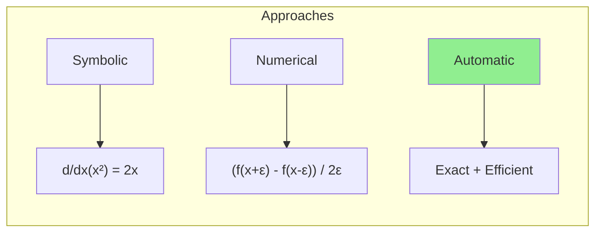

| Approach | Pros | Cons |
|----------|------|------|
| **Symbolic** | Exact, interpretable | Expression explosion, can't handle control flow |
| **Numerical** | Simple to implement | Slow (O(n) evaluations), numerical errors |
| **Automatic** | Exact, efficient, handles control flow | Requires building infrastructure |

Autodiff gives us the best of both worlds: exact derivatives computed efficiently.

## The Computation Graph

The key insight is representing computation as a **directed acyclic graph (DAG)**. Each node is either:
- A **leaf**: input variable or constant
- An **operation**: combines child nodes

Let's trace through `f(x, y) = (x * y) + sin(x)`:

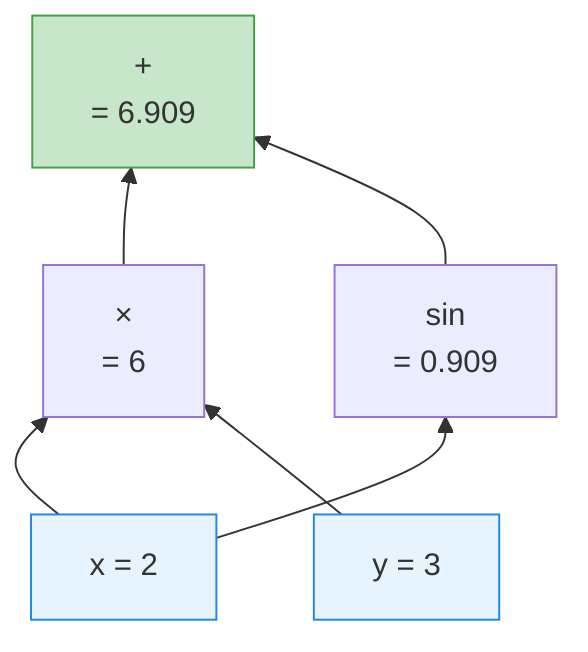

In code, we represent this as:

```rust
pub struct Node {
    pub id: NodeId,
    pub op: Op,
    pub children: Vec<Expr>,  // Expr is Arc<Node>
}

pub enum Op {
    Const(f64),
    Var { name: String, value: f64 },
    Add, Sub, Mul, Div, Neg,
    Pow { exponent: f64 },
    Exp, Log, Sin, Cos,
}
```

Using `Arc<Node>` means cloning an expression is O(1) — we just increment a reference count. This lets the same subexpression appear in multiple places without duplication.

## Forward Pass: Evaluation

The forward pass computes the value at each node, bottom-up:

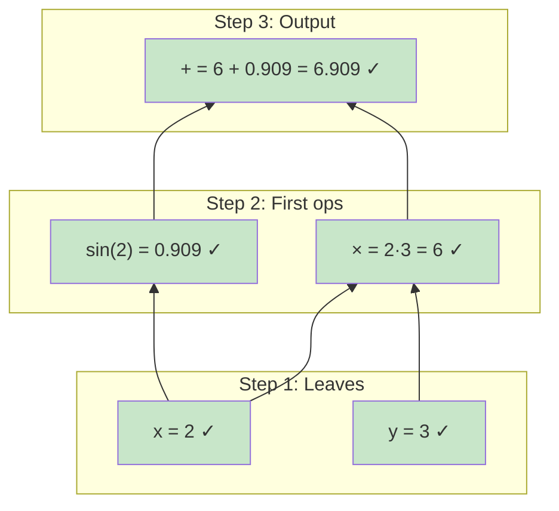

```rust
impl Expr {
    pub fn value(&self) -> f64 {
        match &self.0.op {
            Op::Const(v) => *v,
            Op::Var { value, .. } => *value,
            Op::Add => self.children()[0].value() + self.children()[1].value(),
            Op::Mul => self.children()[0].value() * self.children()[1].value(),
            Op::Sin => self.children()[0].value().sin(),
            // ... other ops
        }
    }
}
```

## Backward Pass: The Chain Rule

Now the magic happens. We want to compute ∂f/∂x for every variable x.

The key is the **chain rule**. If f depends on x through intermediate variable z:

```
∂f/∂x = (∂f/∂z) · (∂z/∂x)
```

In a graph with multiple paths, we **sum** the contributions:

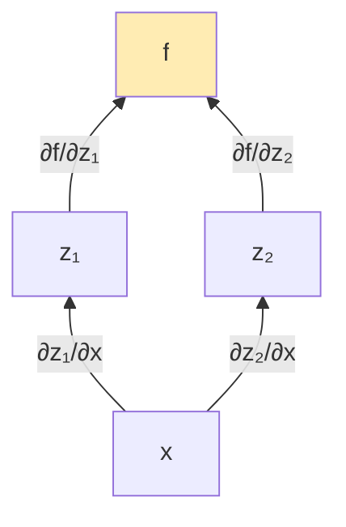

```
∂f/∂x = (∂f/∂z₁)(∂z₁/∂x) + (∂f/∂z₂)(∂z₂/∂x)
```

### Reverse Mode: Top-Down

In **reverse mode**, we start at the output and work backward. We maintain an **adjoint** for each node — the derivative of the final output with respect to that node.

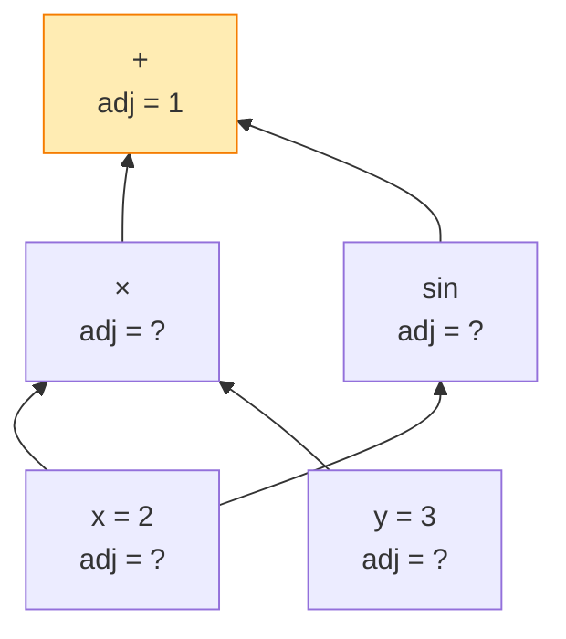

**Step 1**: Output adjoint is 1 (∂f/∂f = 1)

**Step 2**: Propagate through the `+` node

For `z = a + b`, we have ∂z/∂a = 1 and ∂z/∂b = 1.

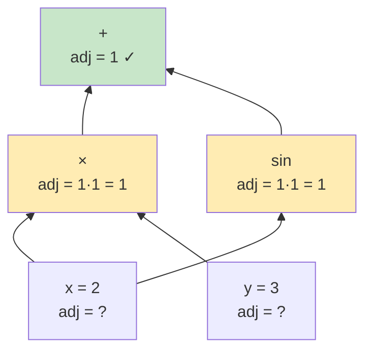

**Step 3**: Propagate through `×` and `sin`

For `z = a × b`: ∂z/∂a = b, ∂z/∂b = a

For `z = sin(a)`: ∂z/∂a = cos(a)

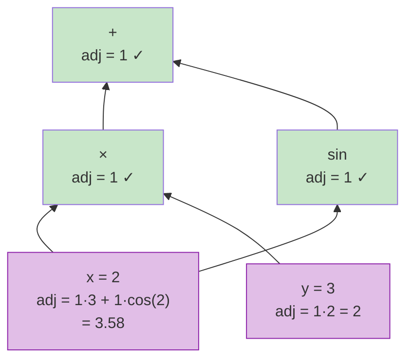

Notice how x's adjoint **sums** contributions from both paths (through `×` and through `sin`).

## The Algorithm

Here's the complete backward pass:

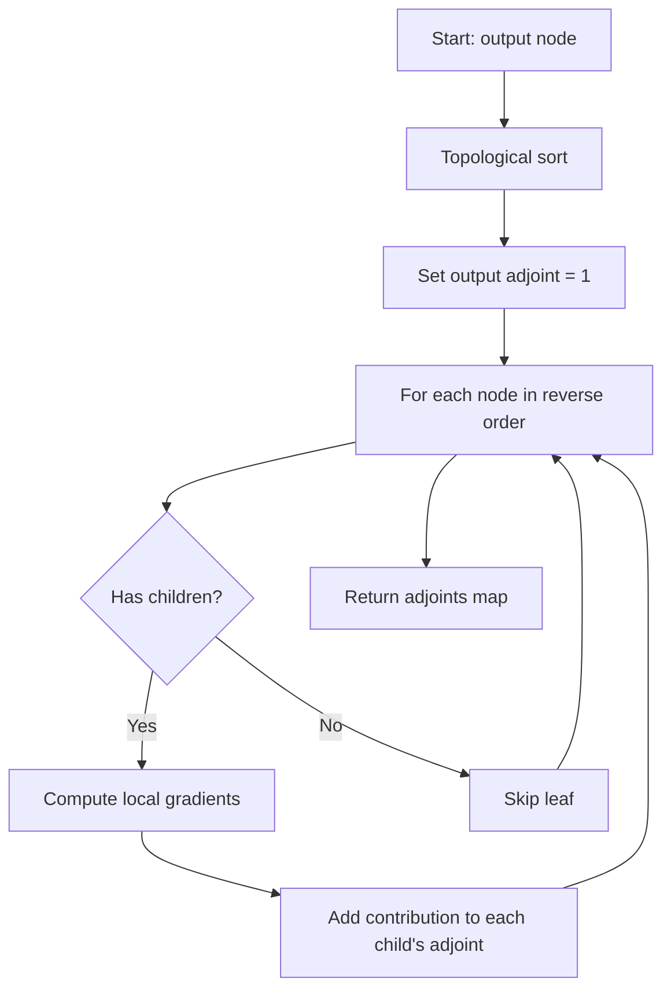

In code:

```rust
pub fn backward(output: &Expr) -> Gradients {
    // 1. Topological sort via DFS
    let topo_order = topological_sort(output);

    // 2. Initialize adjoints
    let mut adjoints: HashMap<NodeId, f64> = HashMap::new();
    adjoints.insert(output.id(), 1.0);  // df/df = 1

    // 3. Reverse traversal
    for expr in topo_order.iter().rev() {
        let node_adjoint = *adjoints.get(&expr.id()).unwrap_or(&0.0);

        // Compute local gradients: d(this_node)/d(child)
        let local_grads = local_gradients(expr.op(), expr.children());

        // Chain rule: child_adjoint += node_adjoint * local_grad
        for (i, child) in expr.children().iter().enumerate() {
            *adjoints.entry(child.id()).or_insert(0.0)
                += node_adjoint * local_grads[i];
        }
    }

    Gradients { adjoints, ... }
}
```

## Local Gradients

Each operation knows its own derivatives:

```rust
pub fn local_gradients(op: &Op, children: &[Expr]) -> Vec<f64> {
    match op {
        Op::Add => vec![1.0, 1.0],           // d(a+b)/da = 1, d(a+b)/db = 1
        Op::Sub => vec![1.0, -1.0],          // d(a-b)/da = 1, d(a-b)/db = -1
        Op::Mul => {                          // d(a*b)/da = b, d(a*b)/db = a
            let a = children[0].value();
            let b = children[1].value();
            vec![b, a]
        }
        Op::Div => {                          // d(a/b)/da = 1/b, d(a/b)/db = -a/b²
            let a = children[0].value();
            let b = children[1].value();
            vec![1.0 / b, -a / (b * b)]
        }
        Op::Sin => vec![children[0].value().cos()],   // d(sin(a))/da = cos(a)
        Op::Cos => vec![-children[0].value().sin()],  // d(cos(a))/da = -sin(a)
        Op::Exp => vec![children[0].value().exp()],   // d(exp(a))/da = exp(a)
        Op::Log => vec![1.0 / children[0].value()],   // d(ln(a))/da = 1/a
        Op::Pow { exponent: c } => {                  // d(a^c)/da = c*a^(c-1)
            let a = children[0].value();
            vec![c * a.powf(c - 1.0)]
        }
        // ...
    }
}
```

## Why Reverse Mode?

There are two modes of autodiff:

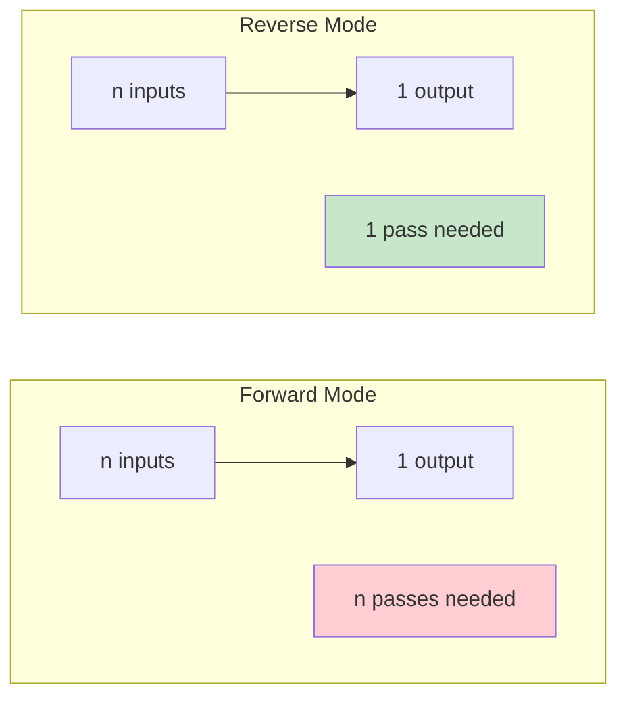

| Mode | Cost | Best for |
|------|------|----------|
| Forward | O(n) passes for n inputs | Few inputs, many outputs (e.g., Jacobians) |
| Reverse | O(1) passes for any inputs | Many inputs, few outputs (e.g., neural nets) |

Neural networks have millions of parameters (inputs) but typically one scalar loss (output). Reverse mode computes **all** gradients in a single backward pass — this is why it's the standard for deep learning.

## Handling Shared Nodes

What if the same expression appears multiple times?

```rust
let x = var("x", 3.0);
let z = &x * &x;  // x is used twice!
```

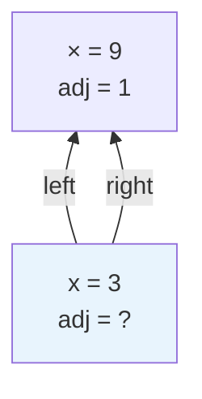

The gradient flows back through **both** edges:

```
∂(x·x)/∂x = ∂(x·x)/∂(left) · ∂(left)/∂x + ∂(x·x)/∂(right) · ∂(right)/∂x
          = x · 1 + x · 1
          = 2x
```

Our algorithm handles this automatically — the adjoint accumulates contributions from all paths:

```rust
*adjoints.entry(child.id()).or_insert(0.0) += node_adjoint * local_grads[i];
//                                         ^^ accumulate, don't overwrite
```

## Diamond Graphs

A more complex case: `z = (x + y) * (x - y)`

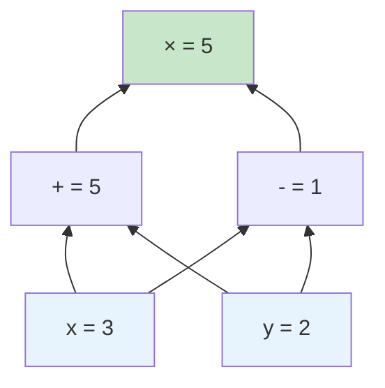

This is actually `x² - y²`, so:
- ∂z/∂x = 2x = 6
- ∂z/∂y = -2y = -4

Let's trace the backward pass:

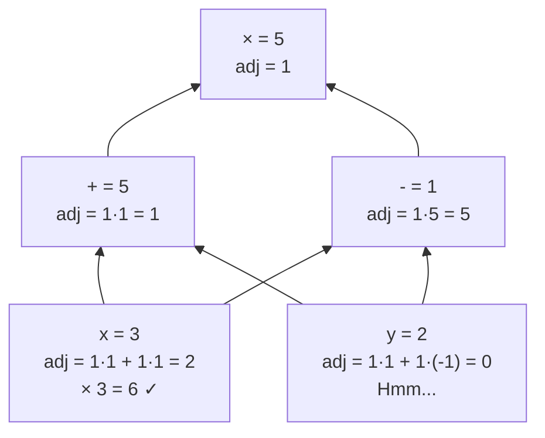

Wait, that's wrong for y! Let me recalculate:

- `mul` adjoint = 1
- `add` adjoint = 1 × (value of sub) = 1 × 1 = 1
- `sub` adjoint = 1 × (value of add) = 1 × 5 = 5
- `x` adjoint = (from add) 1×1 + (from sub) 5×1 = 6 ✓
- `y` adjoint = (from add) 1×1 + (from sub) 5×(-1) = -4 ✓

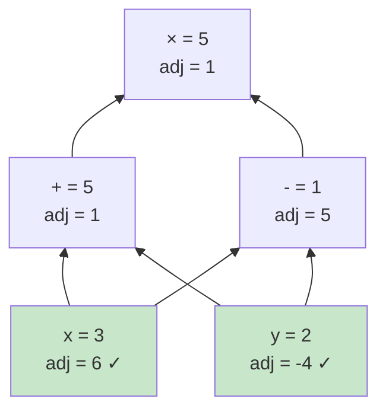

## Verifying Correctness

We validate our autodiff against numerical differentiation:

```rust
pub fn finite_diff_grad<F>(f: F, point: &[f64], eps: f64) -> Vec<f64>
where
    F: Fn(&[f64]) -> f64,
{
    point.iter().enumerate().map(|(i, &xi)| {
        let mut p_plus = point.to_vec();
        let mut p_minus = point.to_vec();
        p_plus[i] = xi + eps;
        p_minus[i] = xi - eps;
        (f(&p_plus) - f(&p_minus)) / (2.0 * eps)
    }).collect()
}
```

Using central differences gives O(ε²) error, so with ε = 10⁻⁷ we get ~10⁻¹⁴ accuracy — enough to validate our exact gradients.

## Putting It All Together

Here's the complete flow:

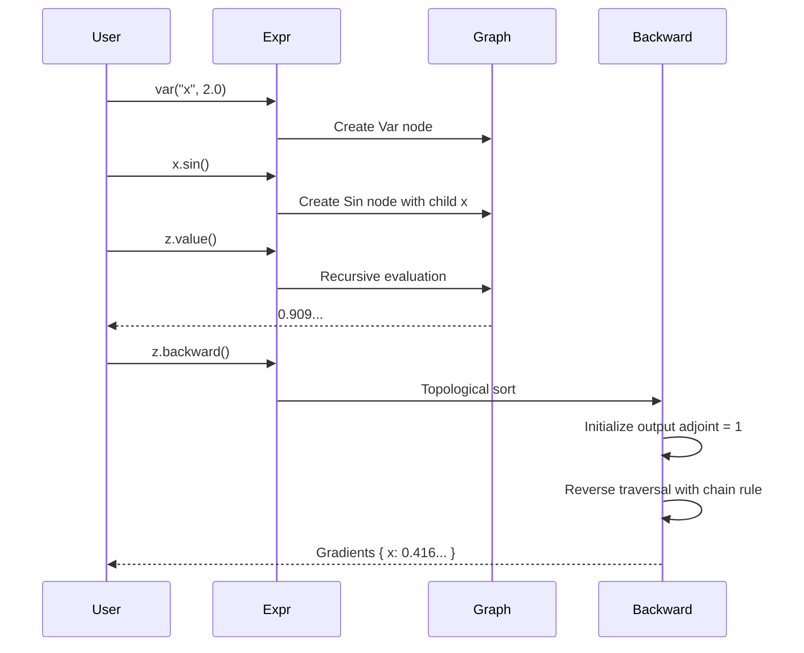

## Performance Considerations

Our implementation prioritizes clarity over speed, but here are optimizations used in production systems:

1. **Caching**: Store forward values to avoid recomputation
2. **In-place operations**: Reduce allocations
3. **Graph pruning**: Skip nodes that don't affect the output
4. **Parallelism**: Independent gradient computations can run in parallel
5. **Operator fusion**: Combine multiple ops into one kernel

## Conclusion

Reverse-mode autodiff is elegant once you see it:

1. **Build a graph** of operations during forward computation
2. **Topologically sort** the nodes
3. **Walk backward**, applying the chain rule at each step
4. **Accumulate** gradients when nodes have multiple consumers

This single backward pass gives us gradients for all inputs — the key insight that makes training neural networks tractable.

The full implementation is available at [github.com/bolu-atx/autodiff-rs](https://github.com/bolu-atx/autodiff-rs).

---

## Further Reading

- [micrograd](https://github.com/karpathy/micrograd) — Andrej Karpathy's minimal autodiff in Python
- [Calculus on Computational Graphs](https://colah.github.io/posts/2015-08-Backprop/) — Chris Olah's visual explanation
- [Automatic Differentiation in Machine Learning: A Survey](https://arxiv.org/abs/1502.05767) — Comprehensive academic overview
